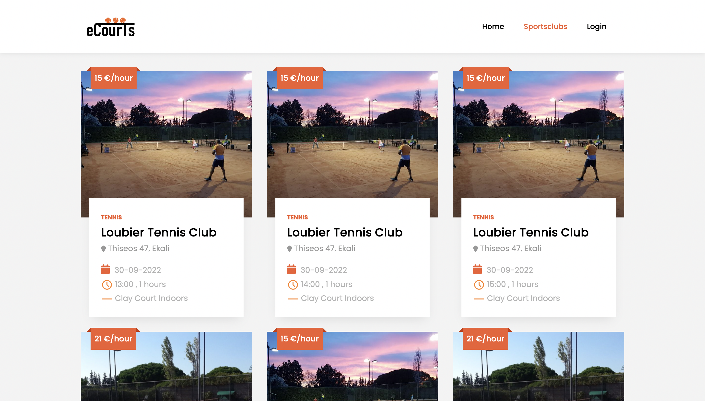

# eCourts
An online sports venue booking platform written with Java

Have you ever found yourself making the frustrating task of booking a sport venue for you and your friends? One phone call after another with no avail? Difficult to find available slots that suit you?

eCourts is web application that simplifies and fully digitizes the process of booking a sport venue by bringing together all available courts on a single platform. So the next sporting activity is just a click away!
  
## Book a court

With eCourts web application you can use a dynamic search bar that enables you to browse around all the available slots that fit your needs. Ajax technique is used to asynchronously retrieve the results. 

  

  

## Manage your courts

## Contact

Feel free to contact us if you found this useful.