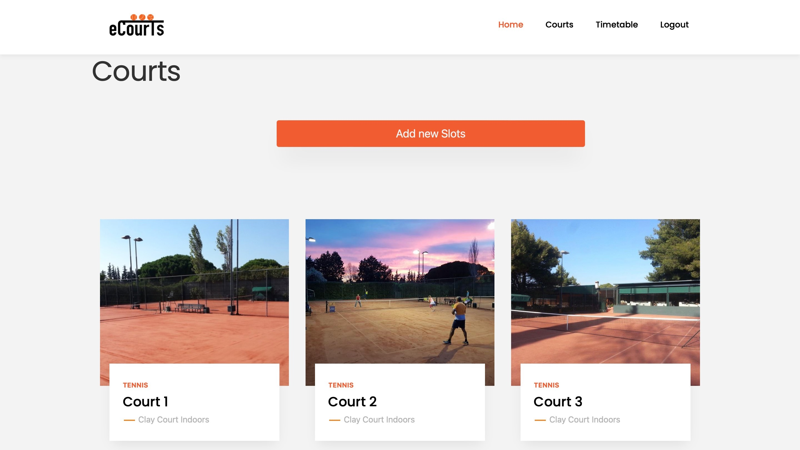
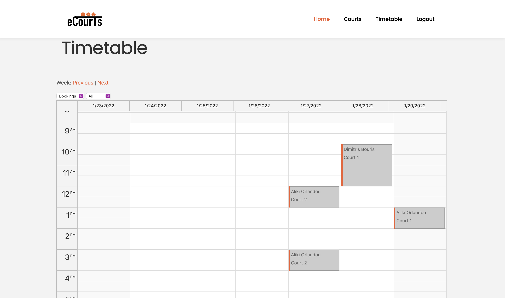

# eCourts
An online sports venue booking platform written with Java

Have you ever found yourself making the frustrating task of booking a sport venue for you and your friends? One phone call after another with no avail? Difficult to find available slots that suit you?

eCourts is a web application that simplifies and fully digitizes the process of booking a sport venue by bringing together all available courts on a single platform. So the next sporting activity is just a click away!

## Book a court

With eCourts web application you can use a dynamic search bar that enables you to browse around all the available courts that fit your needs. Ajax technique is used to asynchronously retrieve the results every time a filter is altered. 

## Manage your courts

If you own sport venues you can utilize them with this web application. You can manage your courts and update their availability with our interface add slots.

## Contact

Feel free to reach out to us if you found this useful or if you want to contribute to this project.